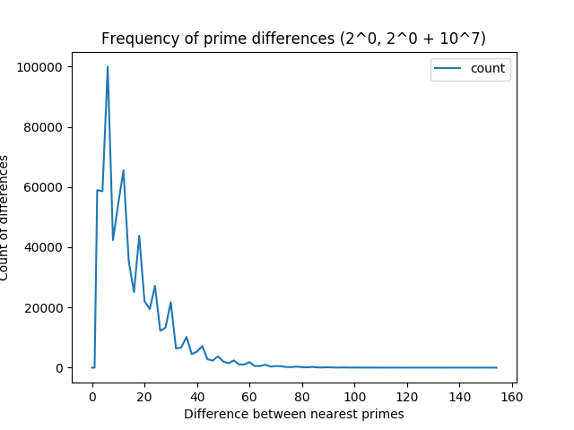
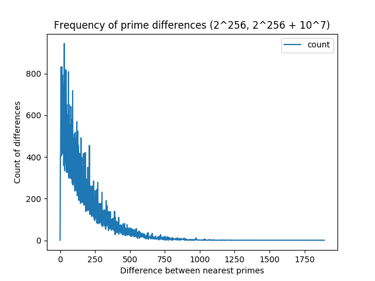
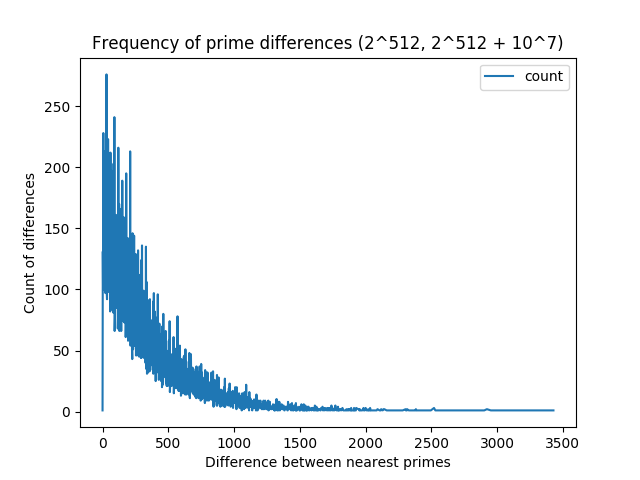
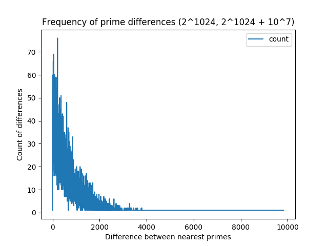
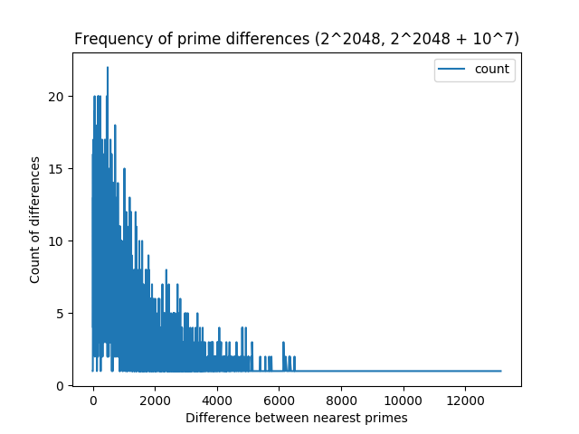
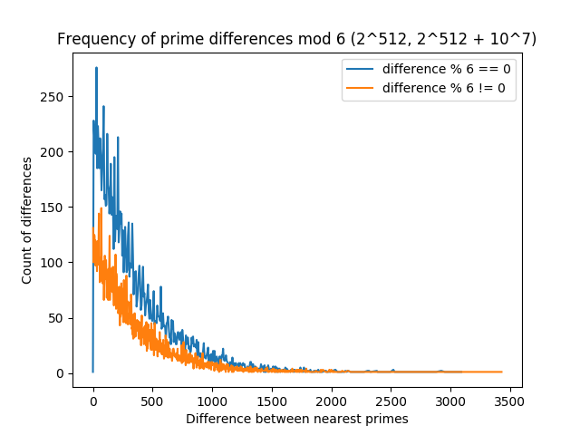

Using this program you can find distribution of prime differences on high number intervals.

### Run

To generate csv file with prime frequency make the following steps:
1. Download gmp [library](https://gmplib.org/list-archives/gmp-announce/2016-December/000047.html) of version 6.1.2 and extract here.
2. Make run.sh file executable `chmod +x run.sh`
3. Execute run script `./run.sh`

## Research

Following intervals were explored:
1. 2^0, 2^0 + 10^7
2. 2^256, 2^256 + 10^7
3. 2^512, 2^512 + 10^7
4. 2^1024, 2^1024 + 10^7
5. 2^2048, 2^2048 + 10^7

### Count of primes

|  interval | prime count |
|---|---|
| 1 | 664578 |
| 2 | 56368  |
| 3 | 28234  |
| 4 | 13948  |
| 5 | 7112   |

### Plots

### A multiple of six

I noticed a frequency of differences which are multiple of six is significantly more than others.
The graph below shows two lines, one has only points that meet the condition `difference % 6 == 0`
and the second line consists of points that do not.

